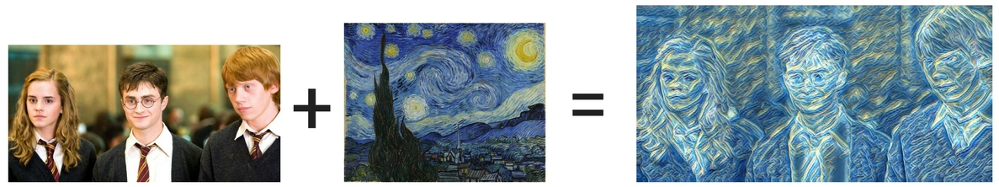
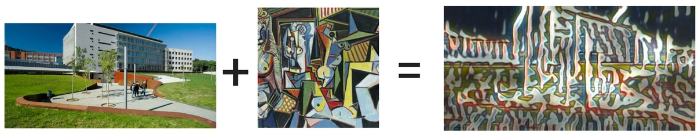
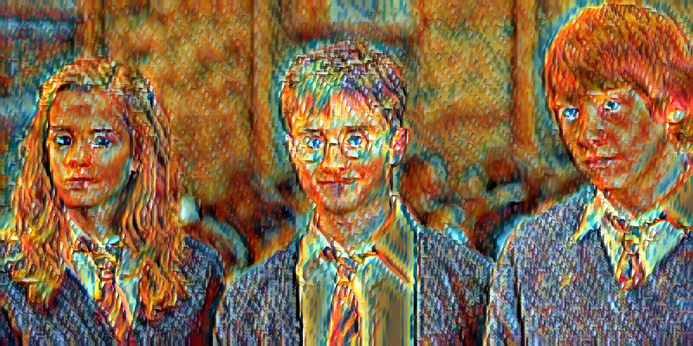
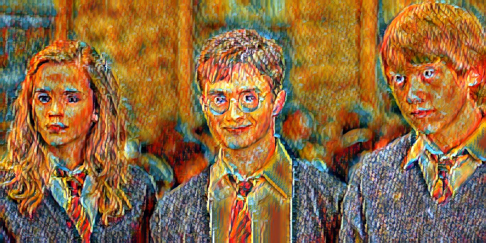
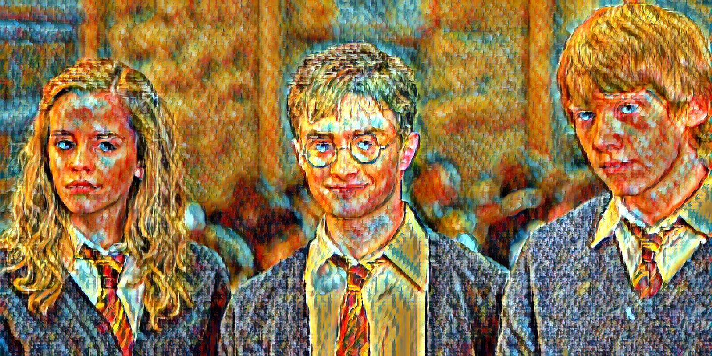
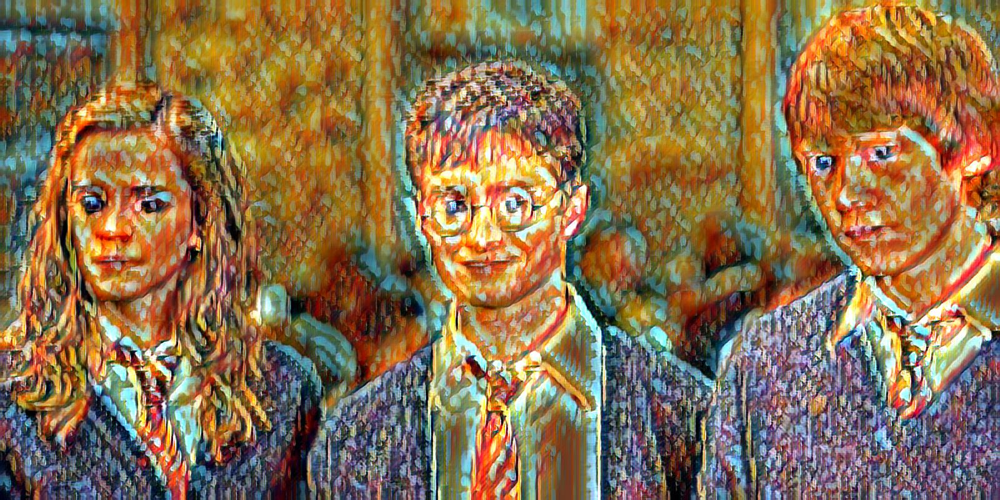
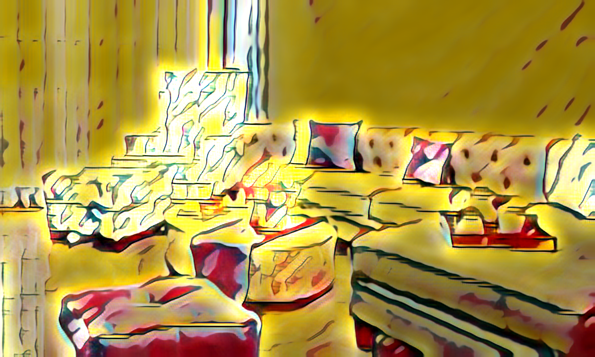
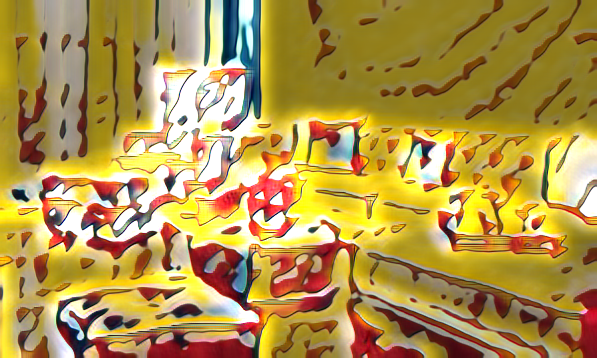

# DLAI 17/18: Style Transfering - Team 1 

Members: Itziar Sagastiberri, Mireia Gartzia, Cristina González, Carolina Fernández-Pedraza.

Link to the repository: https://github.com/carolinafdezp/style_transfering

This is a TensorFlow/Keras implementation of [Arbitrary Style Transfer in Real-time with Adaptive Instance Normalization](https://arxiv.org/abs/1703.06868).

## Requirements

* Python 3.x
* tensorflow 1.2.1+
* keras 2.0.x
* torchfile
* pillow
* opencv

## Concept of style transfer

Style transfer is a technique consisting in recomposing an image into a particular style

## Background on style transfer

There are basically to type of style transfer networks commonly used:

1. Slow and Arbitrary style transfer
	- It uses the VGG network to extract the content and style losses and then performs an iterative optmization that has 		the goal of finding the image output that reduces both losses.
	- It is able to apply to the content image several styles selected, being flexible.
	- But, the optimization process is very time consuming, not being able to work in real time.

2. Fast and limited to the style network
	- It replaces the iterative optimization network by a feed forward network
	- This network is much faster.
	- It is not flexible. To apply to content images different styles, we need to train the network with each of them.

## Implemented project characteristics and architecture:

The style transfer network we have implemented is fast and flexible at the same time.
The general idea is to use as feedforward network input both the style images and content, rather than only the content images as the network commented above does.

The architecture consists basically in three parts:
* Encoding of the content and style input images using layers of VGG19 network.
* Then the AdaIn layer aligns the mean and the variance of the content image to the style image. Since mean and 	    variance contain style information, by using this layer, we are matching the images style.
* The decoder transforms the ouput of the AdaIn layer into the pixel space. This encoder basically mirrors the 	   	     encoder.

## Training

The decoder is trainned to reduce the total loss, which is a weighted sum of the content loss and style loss.

Example of training:

`python train.py --content-path /path/to/coco --style-path /path/to/wikiart --batch-size 8 --content-weight 1 --style-weight 1e-2 --tv-weight 0 --checkpoint /path/to/checkpointdir --learning-rate 1e-4 --lr-decay 1e-5 --max-iter 7000 --save-iter 100`

## Running a trained model

Example of testing:

`python stylize.py --checkpoint checkpoints --style-path images/styles --content-path images/inputs --out-path images/output`

## Results
In the folder called "examples" there are some examples that  we have obtained after executing stylize.py with different options (weights, iterations...).

Also in the folder "styles" and "inputs" we have uploaded the original styles and images used for our experiments (downloaded from Google Images).

	

	

We have done tests by changing several parameters and observing the network results and performance.

The first test was done changing the number of epochs:
* For 2000 epochs

	

* For 7000 epochs

	

* For 20000 epochs

	

We can see that up to 7000 epochs it improves. But, the network suffers from overfitting in epoch number 20000.

Also, we checked the performance for 2000 epochs and two datasets:
* For the whole dataset (50000) the image obtained is:

	

* For the reduced dataset (250 images) the result obtained is:

	

We can clearly see the results are much better for the first case, and that there is overfitting in the second one.

Then, we played with the style and content weights.
* For a low style weight:

	

* For a hight style weight:

	

Finally, we obtained using tensorboard several graphics showing how the losses evolved.

	

	

	

## Problems we had
* Setting up the virtual machine
* Permissions
* We had to change project
* Access to the machine in some computers
* Memory

## What we have learned
Programming Platforms:
* Setting up Google Cloud Platform
* Keras basic functions learning
* Tensorboard issues (acces from PC)
* Jupyter notebook usage
* Github usage

Deep learning:
* Hyperparameters tunning: Underfitting/Overfitting
* Transfer learning (from VGG19)
* Convolutional network architectures

## Notes

* Original paper [here](https://distill.pub/2016/deconv-checkerboard/).

## References
[AdaIN-TF](https://github.com/eridgd/AdaIN-TF)

## Jupyter Notebook
