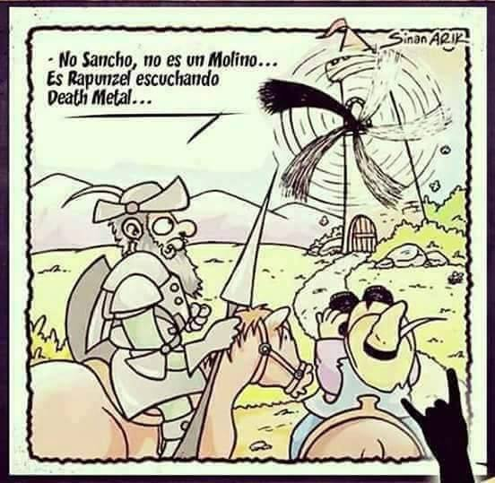

# DLAI Style Transfering - Team 1 

Members: Itziar Sagastiberri, Mireia Gartzia, Cristina González, Carolina Fernández-Pedraza

This is a TensorFlow/Keras implementation of [Arbitrary Style Transfer in Real-time with Adaptive Instance Normalization](https://arxiv.org/abs/1703.06868).

## Requirements

* Python 3.x
* tensorflow 1.2.1+
* keras 2.0.x
* torchfile 

## Training (train.py)

Example of training:

`python train.py --content-path /path/to/coco --style-path /path/to/wikiart --batch-size 8 --content-weight 1 --style-weight 1e-2 --tv-weight 0 --checkpoint /path/to/checkpointdir --learning-rate 1e-4 --lr-decay 1e-5`

## Running a trained model (stylize.py)

Example of execution:

`python stylize.py --checkpoint checkpoints --style-path images/styles --content-path images/inputs --out-path images/output`

## Notes

* Original paper [here](https://distill.pub/2016/deconv-checkerboard/).

## References
[AdaIN-TF](https://github.com/eridgd/AdaIN-TF)

## Some results

	

## Jupyter Notebook
